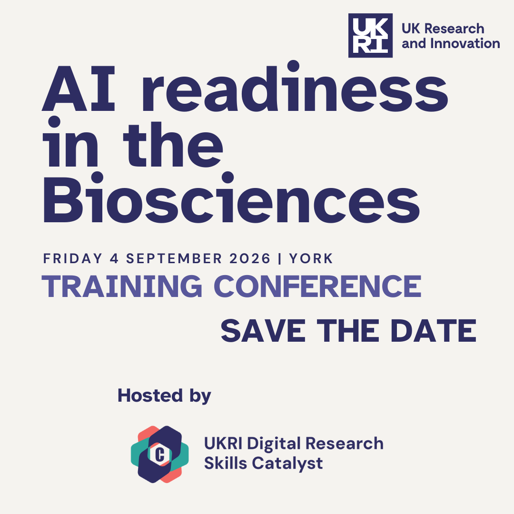

### **Save the date - registration opening soon!**

Join us on Friday 4th September in York! This free full-day training conference is specifically designed to provide ECR/PGR researchers in the biosciences and health with an introduction to AI. We aim to demystify the "black box" of AI, moving beyond the hype to provide you with the foundational knowledge and practical coding skills required to integrate machine learning into your specific research workflows.

## Who Should Attend?

While this conference primarily targets PhD and postgraduate researchers in the biological, medical, and environmental sciences, it is open to professionals at all career stages. Whether you’re a wet-lab scientist venturing into data or a computational biologist aiming to refine your AI skills, this program provides a structured roadmap to expertise.

## Registration

Registration will open in April. 

There are 100 places available for this in-person conference. 

## Programme 

Our sessions are curated to take you from theory to application, ensuring you leave with tools you can use at the bench or the workstation immediately.

-   **Foundations of Modern AI:** Get under the hood of Neural Networks and Large Language Models (LLMs). We’ll break down the architecture of how machines "learn" and how you can leverage these models for data synthesis and hypothesis generation.

-   **Next-Gen Bio-Imaging:** A deep dive into Image Analysis with Napari. Learn to handle multi-dimensional biological images, automate segmentation, and visualize complex data sets in a high-performance environment.

-   **Spatial Transcriptomics & AI:** Explore the frontier of tissue architecture. We will demonstrate how AI identifies patterns in spatial gene expression, allowing you to map cellular functions within their original physical context.

-   **Practical Machine Learning (ML):** A fast-paced demonstration of ML algorithms tailored for biological datasets, focusing on classification and predictive modeling. 

-   **AI in Agriculture:** This talk is intended to be a broad “taster” session, aiming to introduce participants to popularAI concepts that appear in the media or consumer marketing documents (e.g. “deep learning”, “large language model”, etc.).

-   **Sustainable Science:** Learn the principles of reusable analysis. We’ll show you how to build AI workflows that are reproducible, shareable, and robust enough for high-impact publication.

-   **Applied Bioinformatics Spotlight:** A specialised session led by the KCL Applied Bioinformatics Team. This workshop explores how AI and machine learning act as a bridge for multi-omics integration, unlocking deeper biological insights and high-accuracy predictive modeling.

*This is a draft schedule the final programme will be available from April.*

## Venue 

The conference will be held at the Guildhall York, it is a fantastic venue located a short 10 minute walk from York Rail Station. 

Address: The Guildhall York, Coney Street, York, YO1 9QN

## Travel scholarships 
Travel scholarships (up to £100) are available on a first come first serve basis. Lunch and Networking tea/coffee will be included.

{width=250px}

