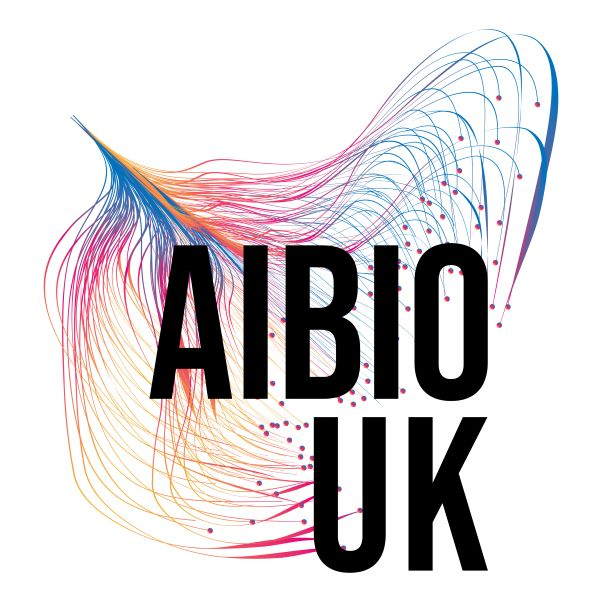

## Save the date - registration opening soon! 

Join us on Friday 4th September in York! This free full-day training conference is specifically designed to provide ECR/PGR researchers in the biosciences and health with an introduction to AI. We aim to demystify the "black box" of AI, moving beyond the hype to provide you with the foundational knowledge and practical coding skills required to integrate machine learning into your specific research workflows.

## Who Should Attend? 

While this conference primarily targets PhD and postgraduate researchers in the biological, medical, and environmental sciences, it is open to professionals at all career stages. Whether you’re a wet-lab scientist venturing into data or a computational biologist aiming to refine your AI skills, this program provides a structured roadmap to expertise.

## Registration

[Register for the Conference.](https://forms.gle/WYfSxUV8eSsZTtgG7)

The Conference is free and there are 100 places available for this in-person event. 

## Programme 

Our sessions are curated to take you from theory to application, ensuring you leave with tools you can use at the bench or the workstation immediately.

-   **Foundations of Modern AI:** Large Language Models (such as Gemini or chatGPT) are at the forefront of the current AI hype wave. In this talk Dr Alastair Droop will provide a brief overview of how Large Language Models work, and discuss their use in bioscience research. Common misconceptions and pitfalls will be explored. 

-   **Next-Gen Bio-Imaging:** A deep dive into Image Analysis with Napari. Learn to handle multi-dimensional biological images, automate segmentation, and visualise complex data sets in a high-performance environment. Image analysis, visualisation and processing are a set of skills required in any medical and bioscience researcher who works with imaging instruments. Napari is an extensible modular based open source framework that is easy to learn and to develop to. This session will introduce how to use it in your research workflow and present some of the plugins that provide AI capabilities to analyse and process your data.

-   **Galaxy for AI in Bioscience: Tools, Training, and Reproducible Workflows** Artificial intelligence is increasingly utilised in bioscience, particularly for high-dimensional omics data,  bioimaging, and structural biology. However, access to tools, infrastructure, and training remains a significant challenge. This session will introduce Galaxy as an open-source, web-based platform that enables researchers to implement AI methods in a reproducible and user-friendly environment.

-   **scryptIQ Supervised Learning Taster Session:** Master the essentials of supervised machine learning in this brief taster session. Using real-world biological data, we’ll walk you through a complete end-to-end workflow — transforming messy, raw data into optimised, high-performance classification models. See firsthand why classical ML is still one of the fastest and most accurate ways to turn biological complexity into predictable insights.

-   **AI in Agriculture:** This talk is intended to be a broad “taster” session, aiming to introduce participants to popular AI concepts that appear in the media or consumer marketing documents (e.g. “deep learning”, “large language model”, etc.).

-   **Applied Bioinformatics Spotlight:** A specialised session led by the KCL Applied Bioinformatics Team. This workshop will introduce how AI and machine learning can help integrate multiomics data to discover biology and make useful predictions.

*This is a draft schedule, the final programme will be available at the end of April.*

## Venue 

The conference will be held at the Guildhall York, it is a fantastic venue located a short 10 minute walk from York Rail Station. 

Address: The Guildhall York, Coney Street, York, YO1 9QN

## Travel scholarships 

Through the [AIBIO-UK Flexifund](https://aibio.ac.uk/), we are pleased to offer travel scholarships to help cover your attendance costs.

-   Standard Travel: Up to £100 per person for economy rail or bus travel
-   Long-Distance Travel: Up to £150 per person for those traveling from further afield who require an overnight stay in York (covers economy travel and hotel expenses)

You will need to reclaim these expenses by completing an expense form and submitting receipts after participation in the course. Scholarships will be provided on a first come first served basis.
We will contact you within a few days of your registration to confirm whether you have been awarded a scholarship. Lunch and Networking tea/coffee will be included.

## Funding 
The Catalyst conference is funded by UKRI award UKRI/ST/B000299/1 and [AIBIO-UK](https://aibio.ac.uk/). The event is intended for those whose work contributes to the UK research and innovation community. Unfortunately, we cannot offer place to other researchers, however there is a catalogue of learning materials available via the [UKRI Digital Research Skills Catalyst](https://digitalskillscatalyst.ac.uk/) website to support your training needs. 

{width=250px}

