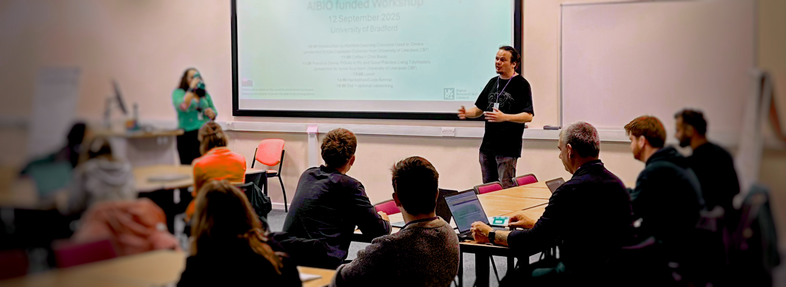
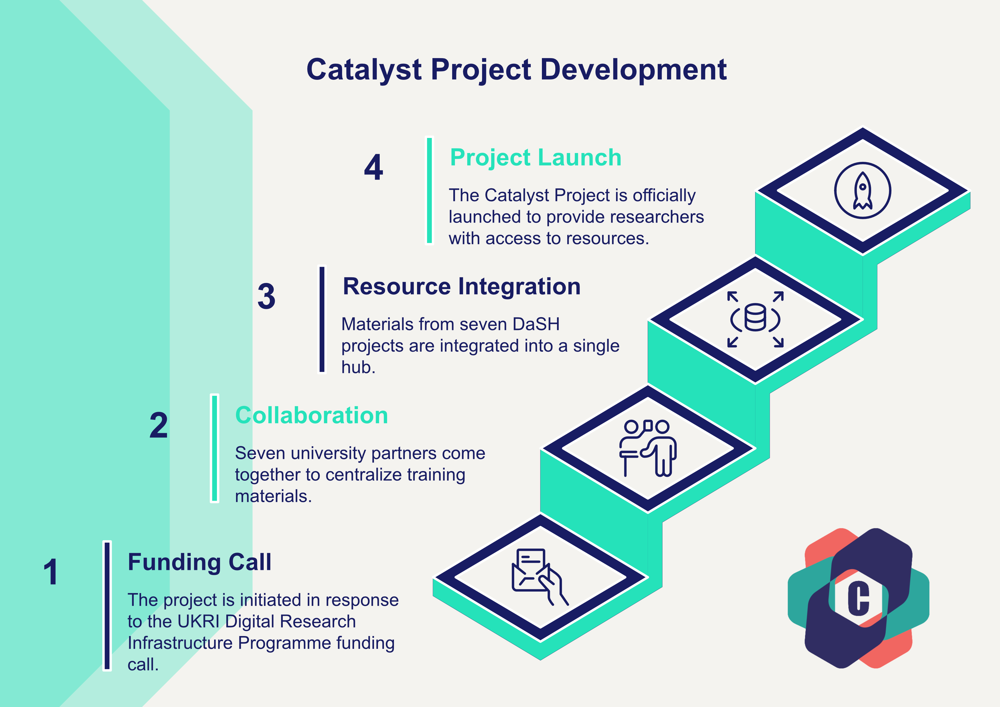

{width=60% fig-cap="Catalyst AI Workshop." style="border-radius:8px; box-shadow:0 4px 12px rgba(0,0,0,0.1);"}

## Connecting researchers with the digital skills needed for modern research

We are thrilled to announce the launch of the **UKRI Digital Research Skills Catalyst**, a major new initiative designed to transform the way researchers and innovators across the UK access digital training and expertise. In an increasingly data-driven world, having the right digital skills is no longer just an advantage—it’s essential.

The Catalyst bridges the skills gap, provides a centralised hub of high-quality resources and direct support to empower you at every stage of your research journey.


### What is the Digital Research Skills Catalyst?

**Access digital training, expert support, and events—all in one place.**

The Digital Research Skills Catalyst is a UKRI initiative designed to improve access to digital skills training for UK based researchers.

It helps you to:

  <p> <i class="fa-regular fa-calendar"></i> Discover relevant courses and resources</p>
  <p> <i class="fa-solid fa-magnifying-glass"></i> Navigate digital learning pathways</p>
  <p> <i class="fa-solid fa-laptop-code"></i> Access curated, high-quality training materials</p>
  <p> <i class="fa-solid fa-user-gear"></i> Build skills aligned with real research needs</p>

By bringing together fragmented resources, the platform makes it easier to find the right training at the right time.

### Who should use the Catalyst?

Whether you are a doctoral student, a principal investigator, or a programme manager, the UKRI Digital Research Skills Catalyst is your new go-to resource for professional growth in the digital age. We invite you to explore the new [website](https://digitalskillscatalyst.ac.uk/), browse the learning portal, and book a consultation to see how we can support your research.

This platform is designed for:

- Early-career researchers building foundational digital skills
- Academics adapting to new research technologies
- Research software engineers and technical staff
- Anyone working with data, AI, or digital tools

If your work involves data or technology, developing digital skills will enhance your research impact and career prospects.

[]{style="display: none;"}


```{=html}
<div id="consult-cards">

<div class="consult-card">
  <div class="icon">
    <i class="fa-solid fa-keyboard"></i>
  </div>
  <h3>Explore the Learning Portal</h3>
  <p>A searchable library of over 50 high-quality resources.</p>
<br>
 <p>Designed to save you time and enhance your learning experience, the portal allows you to quickly locate resources tailored to your expertise, research area, and preferred study mode. </p>
<br>
     <p> <a href="https://digitalskillscatalyst.ac.uk/">Browse the learning resources</a> </p>

</div>


<div class="consult-card">
  <div class="icon">
    <i class="fa-solid fa-code"></i>
  </div>
  <h3>Get expert support</h3>
  <p>Resolve coding issues and learn best practices for research software development.</p> 
<br>
<p> Access tailored support exactly when you need it with our Digital Research Specialists.
  </p>
<br>
  <p> <a href="https://digitalskillscatalyst.ac.uk/consult.html">Book one-to-one sessions</a></p>

</div>

<div class="consult-card">
  <div class="icon">
    <i class="fa-solid fa-user-group"></i>
  </div>
  <h3>Join workshops and events</h3>
  <p>Connect with peers and learn from experts through our events programme.</p>
<br>
<p>Training events are delivered both online and in person. These engaging sessions are often free or offered at a reduced cost, and are led by experienced instructors passionate about sharing their expertise.</p>
<br>
<a href="https://digitalskillscatalyst.ac.uk/news.html">Sign up for an event</a> 
</div>
</div>
```
### Built on proven success

Led by Professor Emma Rand at the University of York and funded by the UKRI Digital Research Infrastructure Programme UKRI/ST/B000299/1, the Catalyst builds on the successful foundation of the Data Science Training in Healthcare & Biosciences (DaSH) funding call. By centralising resources from seven DaSH projects into one accessible hub, we are ensuring that valuable training materials are readily available to the wider research community.

{width=60% fig-cap="The Catalyst brings together training, expertise, and community into one unified platform." style="border-radius:8px; box-shadow:0 4px 12px rgba(0,0,0,0.1);"}

### Get in touch 

Digital skills are now essential for research. The Catalyst helps you build them faster and more effectively.

For questions about our training programmes, events, or consultation services: <a href="mailto:research-digital-skills@york.ac.uk">research-digital-skills@york.ac.uk</a>

Explore the Catalyst platform and start building your next skill: [www.digitalskillscatalyst.ac.uk](https://digitalskillscatalyst.ac.uk/)


