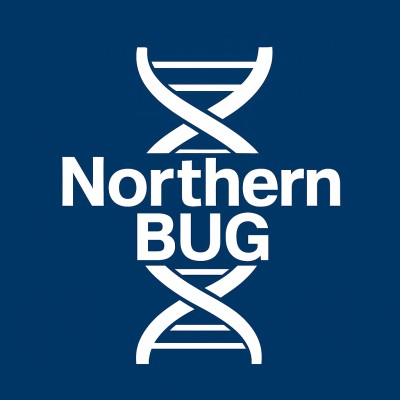

We are offering **five travel scholarships** to support attendance at the [Northern Bioinformatics User Group (NorthernBUG) meeting](https://northernbug.github.io/northernbug16), taking place on **24 July 2026** at the **University of Bradford Norcroft Centre**.

::: {.callout-important}

## Key information

📅 **Event:** NorthernBUG 16

📍 **Location:** University of Bradford Norcroft Centre, Bradford

🎓 **Scholarships available:** 5 travel scholarships

⏰ **Application deadline:** 12:00pm, Wednesday 15 July 2026

:::

### About NorthernBUG

NorthernBUG is a network of bioinformaticians and users of bioinformatics services across the north of England. Through quarterly meetings, the network brings together researchers and practitioners working with biological data to share expertise, ideas, and emerging research.

Meetings are **free and open to anyone** interested in bioinformatics and its applications in life science research and related fields.

Early career researchers are particularly encouraged to attend and present their work. NorthernBUG provides an excellent opportunity to:

- practise presentations and talks
- share new ideas and approaches
- showcase early-stage research
- connect with the regional bioinformatics community

{width=30% fig-cap="NorthenBUG"}

### How to apply

1. Register for the [NorthernBUG meeting](https://northernbug.github.io/northernbug16)
2. Complete the travel [scholarship application](https://forms.gle/GJvpPV5aMhgjkQUi6)

Applications close at **12:00pm on Wednesday, 15 July 2026.**

All applicants will be notified of the outcome by Thursday, 16 July 2026.

[Apply for a scholarship](https://forms.gle/GJvpPV5aMhgjkQUi6){.btn .btn-primary}

### Upcoming training events

Check out upcoming Catalyst events: 

**[Quarto Workshop](https://digitalskillscatalyst.ac.uk/news/2026-01-13-quarto2.html)** – ONLINE – 22 July 2026  

**[AICatalyst2026: AI in the Biosciences Training Conference](https://digitalskillscatalyst.ac.uk/aiconference2026.html)** – YORK – 4 September 2026

### Get in touch 

For questions about our training programmes, events, or consultation services: <a href="mailto:research-digital-skills@york.ac.uk">research-digital-skills@york.ac.uk</a>

Explore the Catalyst platform and start building your digital research skills: [www.digitalskillscatalyst.ac.uk](https://digitalskillscatalyst.ac.uk/)
