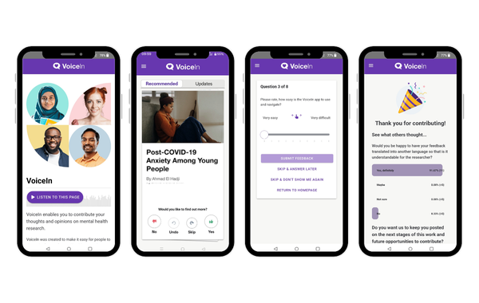

### About VoiceIn

VoiceIn is a mobile app and digital research platform that makes it easier for people to be included in health research. It enables members of the public to contribute to research ideas in a quick and simple way and helps researchers to easily connect with diverse voices.   

::: {.center-caption}
{width=30% fig-align="center" fig-cap="VoiceIn App"}
:::

VoiceIn was co-designed with and by young people to encourage long-term commitment, confidence, and engagement with health research. It is free and available for both researchers and public contributors, aged 16+ and based in the UK.

VoiceIn aims to work alongside traditional patient and participant involvement (PPIE), not to replace existing valuable modes of PPIE, but to offer new ways for people to contribute to health research.

It is a national initiative, led by the University of Manchester, funded by the UKRI Medical Research Council and NIHR Applied Research Collaboration Greater Manchester.  

### How it works?

VoiceIn is two things that work together: mobile app and digital research platform

The mobile app is for patient and public contributors and is available on [Apple Store](https://apps.apple.com/gb/app/voicein/id6714478547) and [Google Play](https://play.google.com/store/apps/details?id=uk.ac.manchester.dhs.voicein&gl=UK). On the Voicein app, people can:
- Discover studies that match their personal interests in health research 
- Provide quick feedback on research ideas from their phone 
- Contribute confidently and anonymously, anytime, anywhere
- Stay up to date with research that matters to them 

The researcher platform allows researchers to easily add their work. Designed to support them throughout the research cycle, researchers can:
- Engage with diverse audiences across the UK
- Collect quick, real-time responses 
- View contributors' key demographics
- Keep contributors updated at all stages of their research

At every stage of the research cycle, VoiceIn enables researchers to inform people clearly, consult them meaningfully, and include them in shaping decisions.
	
### Get in touch
To learn more about VoiceIn, check our website - [https://voicein.org](https://voicein.org) or contact the team at voicein@manchester.ac.uk for a short demo.

