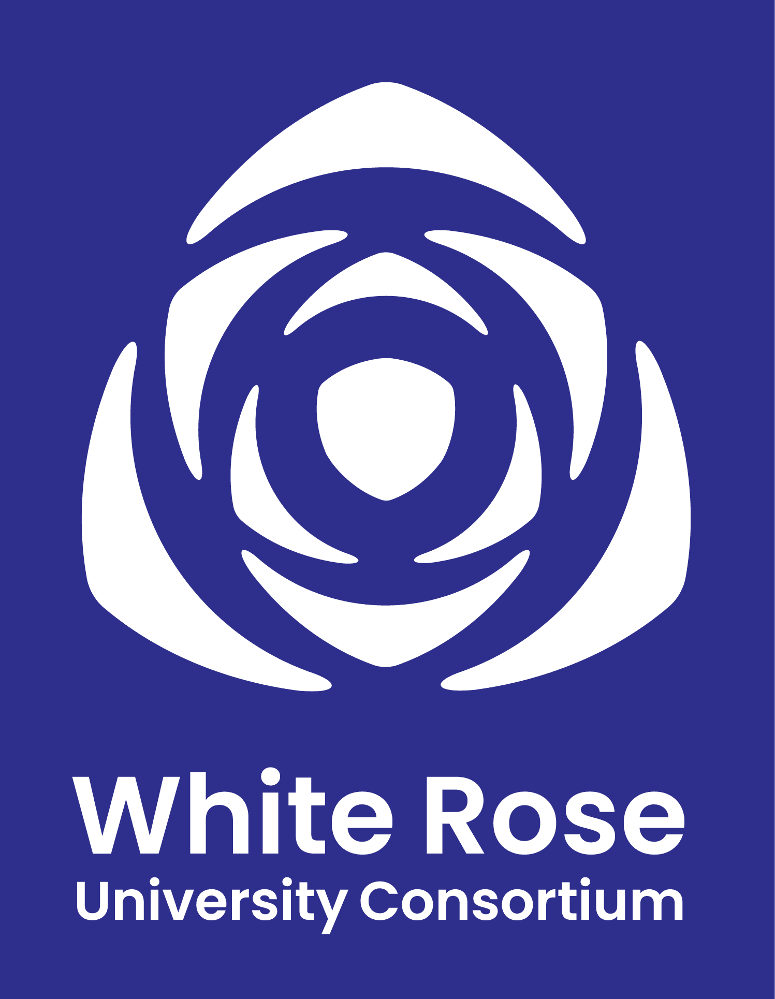

---
format:
  html:
    css:
      - ../course-page.css
      - ../style.css
    toc: false
    echo: false
    keep-hidden: true
    code-tools: false
    page-layout: full
---
<!-- This hidden span ensures Quarto loads the fontawesome package -->

[]{style="display: none;"}

# White Rose PRISM Coffee & Chat Scheme 2026/27: Call for Registrations! 

{fig-align="center" width="20%"}

::::: {.course-page-layout .column-page}
::: course-content

We are pleased to share details of the White Rose Coffee and Chat Scheme which is back for 2026! This is a fantastic opportunity to connect with PRISM* colleagues across the Universities of Leeds, Sheffield and York. 

Sign up or share with your PRISM colleagues at White Rose Rose institutions.

## Are you managing research projects and looking to connect with others in similar roles?

Managing large, post-award research investments comes with unique hurdles. That’s why the White Rose University Consortium is bringing back the PRISMs Coffee & Chat scheme for 2026/27.

The White Rose Consortium invites all PRISMs (Project Managers, Network Managers, CDT Managers, and related roles) to join their cross-institutional networking scheme.  

Designed specifically for busy staff, this scheme pairs you with peer colleagues across York, Leeds, and Sheffield to:   

- Exchange practical solutions to common project management challenges.  
- Gain fresh perspectives on institutional workflows and career development. 
- Build meaningful cross-university relationships with a minimal time commitment.  

## Who can sign up?
This scheme has been designed specifically for PRISMs (Professional Research Investment & Strategy Managers) across the Universities of Leeds, Sheffield, and York.

This initiative bridges the gap between and within the White Rose institutions to create an open, supportive community where you can share challenges and experiences, compare notes, and grow your network.

This scheme is built to offer maximum connection with minimal time commitment.


## How it works

- From **November to February**, you’ll be matched with a PRISM at a similar grade, or interest from one of the partner universities.
- You’ll arrange a short, informal **zoom call or in-person meeting** at a time that suits you both.
- Over the course of four months, you’ll connect with **three different PRISMs**, gaining insights into a variety of roles, disciplines, and institutions.
- These one-on-one conversations are a chance to share experiences, exchange ideas, and explore career development opportunities.

## Ready to build your network?

Complete the short registration form by **31st October** to take part in the November-February sessions. Any questions? Get in touch with the team at info@whiterose.ac.uk 

[Find out more about the White Rose PRISM Network](https://whiterose.ac.uk/network/white-rose-prism-network/)

Not a PRISM member yet? [Join the network today!](https://www.pris-managers.ac.uk/join) 

*PRISMs are Professional Research Investment & Strategy Managers. They predominantly work post-award to deliver large, complex research investments. Titles vary but include Project Manager, Network Manager, Project Co-ordinator, CDT Manager.

:::

::: event-details-sidebar
```{ojs}
//| eval: true
html`
<h3>Details</h3>

<div class="event-detail-item">
  <div class="event-detail-icon">
    <i class="fa-regular fa-calendar-days"></i>
  </div>
  <div class="event-detail-content">
    <p>Scheme runs</p>
    <p>Nov 26 - Jan 27</p>
  </div>
</div>

<div class="event-detail-item">
  <div class="event-detail-icon">
    <i class="fa-regular fa-clock"></i>
  </div>
  <div class="event-detail-content">
    <p>Time slots</p>
    <p>Approx 45 min chats x3</p>
  </div>
</div>

<div class="event-detail-item">
  <div class="event-detail-icon">
    <i class="fa-solid fa-location-dot"></i>
  </div>
  <div class="event-detail-content">
    <p>Location</p>
    <p>Online or in-person</p>
  </div>
</div>

<div class="event-detail-item">
  <div class="event-detail-icon">
    <i class="fa-solid fa-sterling-sign"></i>
  </div>
  <div class="event-detail-content">
    <p>Fees</p>
    <p>Free</p>
  </div>
</div>

<a href="https://forms.cloud.microsoft/pages/responsepage.aspx?id=qO3qvR3IzkWGPlIypTW3y8dKn3hhYZRCvAH0HQcYnoBUQ0NBU0xFQzQ5NVVVOFNJVjM4UzJRWlpaRSQlQCN0PWcu&route=shorturl" class="register-button">Book Now</a>

<div class="questions-section">
  <p>Questions?</p>
  <a href="mailto:info@whiterose.ac.uk">info@whiterose.ac.uk</a>
</div>
`
```
:::
:::::
